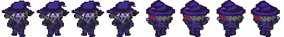
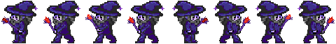
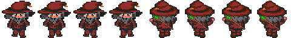
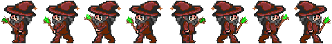
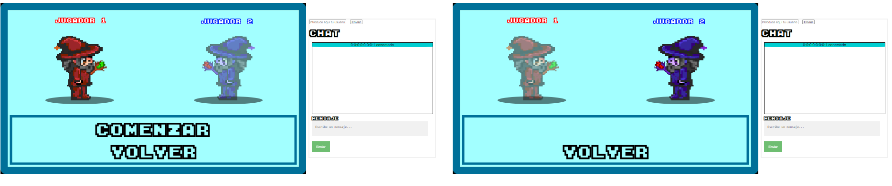
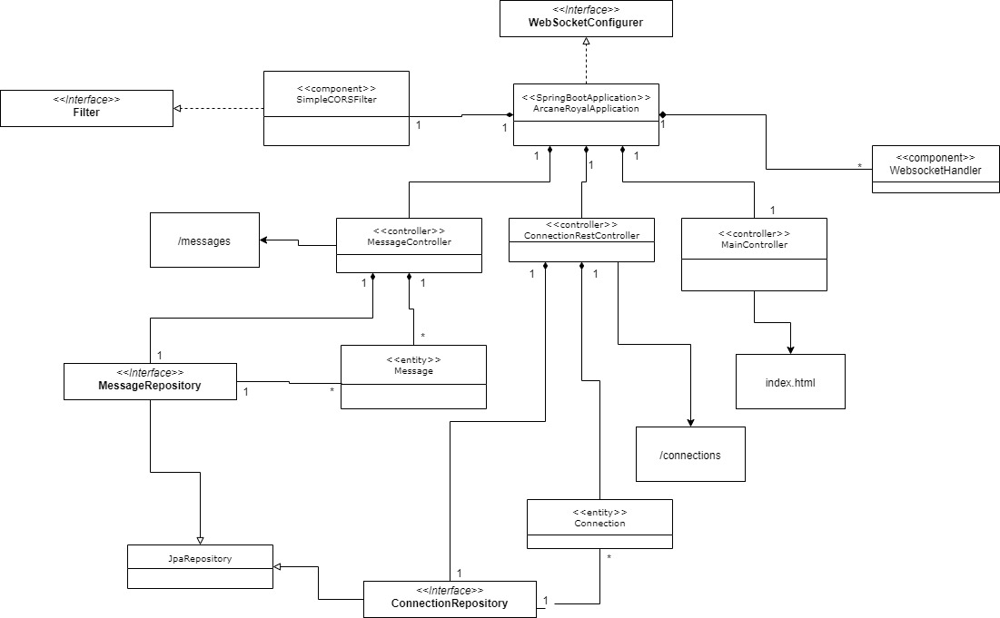

# Arcane-Royal

[Enlace a Trello](https://trello.com/invite/b/PfOO09JO/b86f813eaef5f1efb47f4e8dc26e1f74/juegos-en-red)

## Documento de diseño

#### Concepto general:
Juego multijugador en el que hasta cuatro magos luchan hasta que solo queda uno.

#### Género:
Multijugador, Battle Royale, Rol, Shooter en vista cenital.

#### Audiencia objetivo:
Todos los públicos, gente a la que le guste el género “battle royale”, los juegos de acción en 2D o incluso simplemente los juegos de multijugador competitivos.

#### Aspectos únicos:
Controles simplificados, aspecto agradable, partidas rápidas e intensas, multijugador en red.

#### Experiencia de juego:
El jugador toma el control de su avatar (El mago). Una vez todos los magos estén reunidos, participaran en distintas fases del torneo de hechizos. El jugador experimentará una experiencia de juego frenética y divertida, en la que las partidas sean breves e intensas, lo que hará que quiera seguir jugando “una ronda más”. Además, al jugar con amigos es mucho más entretenido ya que podrán interactuar de forma competitiva.

#### Estilo artístico: 
 

En esta primera pantalla encontraremos el logotipo del juego junto al cuadro de texto para introducir nuestro usuario. También podremos encontrar un botón de ayuda y un botón para iniciar la sesión.

La segunda pantalla representa lo que el jugador encontrará al iniciar la sesión. Esperará en una sala junto a otros jugadores. En la sala tendrá un botón para decir que está listo para jugar, a lo que una vez estén todos listos comenzará la partida tras una cuenta atrás. También puede encontrar un selector de estadísticas para personalizar su personaje.

Tras la pantalla de sala de espera se desarrollará la partida, en la que interactuamos con el mapa usando el ratón y podremos ver las distintas habilidades en la interfaz de usuario

Por último, al acabar las rondas correspondientes, se hará recuento de puntos y se pasará a la pantalla de puntuaciones mostrando un ranking de jugadores.

#### Mundo de ficción:
El jugador se encuentra en un torneo de hechizos, en el cual tendrá que superar a sus rivales en una gran batalla para determinar quién será el gran mago del mundo mágico.

#### Monetización:
Juego completamente gratuito.

#### Plataforma:
Juego orientado a navegador, preferiblemente desde un ordenador.

#### Funciones principales: 
Primero, el jugador encontrará una pantalla de inicio en la que deberá escribir su nombre de usuario. Los jugadores accederán a una sala multijugador en la cual se les asignará un equipo, y deberán indicar si están listos mediante un botón.

 Una vez todo el mundo esté listo y tras una cuenta atrás, empezará la partida y cada jugador aparecerá en una posición del campo de batalla y tendrán que recoger poderes para desbloquear sus habilidades, que usarán para eliminar a los demás jugadores y poder ganar. Una vez finalizada la ronda se le otorgará un punto al ganador. Al llegar a 10 rondas se hará recuento y el jugador con más puntos será el vencedor. Al acabar de hacer recuento podrán volver a empezar.

Dentro del juego existen 3 tipos de poderes: ofensivos, defensivos y aumento de estadísticas.

#### Objetivos: 
Durante la partida deberán moverse para buscar sus poderes y poder derrotar a los otros jugadores, quedando así solo uno, el ganador. Tras ganar una ronda, volverá a reiniciarse el campo de batalla, y así sucesivamente. Cuando un jugador obtenga 10 victorias, el juego acabará y se presentará una pantalla con el ranking de jugadores, y un botón para reiniciar el juego y volver a la pantalla de selección de nombre.

#### Sistemas de juego: 
El juego se ejecutará en el navegador, y principalmente se controlara con teclado y ratón.
En la pantalla de inicio el jugador deberá introducir su nombre con el teclado para saltar a la pantalla de matchmaking y entrar al lobby una vez ha encontrado partida. En la pantalla del lobby los jugadores deberán indicar si están listos mediante un botón, con el que se interactúa haciendo clic.

Dentro de la partida el jugador se moverá clicando hacia el punto al que desea desplazarse. Al hacer esto también se podrá interactuar con elementos del mapa. Para ejecutar las habilidades se usarán las teclas.

#### Interactividad:
La interactividad en Arcane Royal, gracias a sus controles simplificados y conocidos debido a que se basan en géneros muy popularizados como los MOBA , y su sistema de partidas cortas y por rondas, permite que el jugador tenga una experiencia de juego frenética y divertida, de manera que no se canse del juego y quiera seguir jugando.

#### Lista de posibles características adicionales: 
Las siguientes características son ideas que nos han surgido y que trataremos de incorporar al juego, sin embargo, somos conscientes de que debido a la naturaleza del proyecto, no contamos con todo el tiempo necesario para hacer un juego completo y es posible que muchas de estas características no puedan ser implementarlas.

#### Personalización de las estadísticas: 
Antes de entrar a la partida los jugadores podrán ver y personalizar sus estadísticas iniciales mediante una serie de puntos. Estas estadísticas luego podrán ir aumentando a lo largo de la partida mediante los aumentos de estadísticas. Esto permite un abanico más amplio de estilo de juego para los jugadores y les permite jugar de una forma u otra según su estilo.

#### Diferentes tipos de magias: 
Se podrían implementar 4 elementales para las magias (los típicos fuego, agua, tierra y hielo por ejemplo) y hacer que cada tipo tuviese una ventaja contra un tipo y una desventaja contra otro tipo, afectando tanto a los poderes ofensivos como a los defensivos.

Powerups a lo largo del mapa: Para darle más variedad a las partidas, una buena idea sería introducir distintos tipos de potenciadores que den vida (pociones) o den una ventaja temporal (posibilidad de moverse más rápido, hechizos más fuertes, capas de protección que bloqueen los ataques de los contrincantes...). También, en el caso de implementar los tipos de magias se podría introducir un ítem que te permitiera cambiar el elemento de tu magia. Todos estos objetos aparecen aleatoriamente cada cierto tiempo a lo largo del campo de batalla.

#### Modos de juego adicionales:
Enfrentamiento por equipos: El modo propuesto inicialmente es un modo todos contra todos, un deathmatch. Una buena idea sería agregar un modo distinto en el que se puedan enfrentar dos equipos de dos jugadores.

Hacer un segundo mapa que permita que jueguen más jugadores en la partida: Inicialmente, el juego se planteó como un juego para 4 jugadores pero posiblemente se podría hacer un mapa mayor al del modo principal e incluir la posibilidad de que jueguen más personas a la vez. Esto también se podría aplicar al modo por equipos haciendo que los equipos sean mayores o que haya más de dos equipos.

Modo gran torneo: Se podrían agregar torneos al juego basándose en el modo por equipos. En este modo, múltiples equipos se van enfrentando entre ellos a lo largo de varias rondas hasta que sólo queda un vencedor.

#### Fase 2: Desarrollo de juego en local

 

#### Escena de Menú principal

###### Sprites obtenidos de https://opengameart.org

#### Sprites creados por nosotros

   

  

#### Escena de Juego

#### Desarrollo de la fase 2

Para la segunda fase del desarrollo del juego hemos priorizado las funcionalidades básicas, tales como la pantalla del juego y un menú de inicio.

Hemos desarrollado un mapa de juego, y hemos implementado las mecanicas basicas de la partida, asi como unicamente un modo de juego con dos personajes para la versión local. 

Actualmente el juego se compone de una pantalla de inicio con un botón Play, que nos lleva automaticamente a la pantalla de juego.

Hemos implementado un sistema de colisiones, para que el personaje no se mueva por zonas intransitables ni se salga del mapa. Tambien hemos desarrollado el sistema de powerups, con tres tipos diferentes (vida, daño y escudo), que se generan aleatoriamente. También hemos realizado un sistema de interacción entre los diferentes objetos del juego y personajes.

Como parte final, cabe destacar que principalmente queremos implementar los diferentes menús (pausa , opciones, controles, créditos etc..), sonidos, interfaz de juego para indicar información en partidas, nuevo mapa.

#### Fase 3: Implementando características API Rest y mejoras respecto a la versión anterior

#### Cambios en la versión local

Uno de los cambios más importantes ha sido la adición de nuevos mapas, se han añadido 4 mapas a la versión anterior, lo que hace que junto con el mapa original, tengamos ahora un total de 5 mapas. Además es posible añadir nuevos mapas facilmente ya que estos se hacen mediante archivos .txt, el programa lee estos archivos y pinta los tiles en su correspondiente posición, por lo que los maps agregados son facilmente modificables y también podemos añadir nuevos mapas facilmente si así lo deseamos.

Mapas añadidos y su versión en el txt:
 

Relacionado con esto también hemos implementado una partida jugable completa, esto es, al comenzar la partida se jugará un mapa hasta que uno de los magos mate al otro. Al lograrlo, se le añadirá un punto al mago que haya salido victorioso y se cargará el siguiente mapa (los mapas, tanto el primero como los siguientes se cargarán de forma aleatoria eligiendo uno de los 5 mapas implementados). Los magos seguirán compitiendo hasta que uno de ellos logre un total de 5 puntos, después de esto regresaremos al menú principal (tenemos pensado implementar una pantalla de puntuaciones más adelante para que ambos jugadores puedan ver su rendimiento en la partida).

También hemos hecho una mejora considerable de los gráficos del juego, hemos cambiado los tiles por completo y hemos agregado la interfaz que faltaba en la versión anterior, esta interfaz le da al jugador información sobre su estado y el estado de la partida, le muestra los puntos de cada mago en la partida, su barra de salud y si dispone de una carga para poder disparar.

Así se ve el juego actualmente:
 

Además de esto, hemos cambiado el fondo del menú, la fuente de las letras y hemos agregado nuevas pantallas, una de controles (que le muestra al jugador como se juega), una de créditos (en la que salen nuestros nombres) y una pantalla para introducir el usuario que aparece después de darle a Jugar (aunque no hemos podido terminarla completamente porque hemos tenido problemas para meter un textfield en medio de la pantalla).

Pantallas del menú actualmente (Menú, Controles, Créditos y pantalla inacabada de introducción del nombre de usuario respectivamente):
 

Además hemos corregido algunos errores que había con la generación de ítems y hemos mejorado las colisiones con los bordes del mapa, también es posible volver al menú principal en medio de una partida pulsando la tecla Escape.

Y por último, aunque no los hemos podido implementar, hemos buscado efectos de sonido y música para el juego, pero Phaser nos ha dado problemas para implementarlos, por lo que actualmente no están en esta versión.

#### Implementación de características de red usando API Rest

Hemos implementado las primeras funcionalidades de red a nuestro juego, la primera de ellas es una lista de conexiones, el juego detecta cuando un nuevo jugador se une a la partida y cuando se desconecta. 

Todo esto lo pueden ver los jugadores en el chat, el cual es la otra función que hemos implementado, los jugadores pueden mandarse mensajes desde una ventanita que aparece a la derecha del juego y en la que se muestran tus mensajes y los del resto de jugadores conectados contigo.

También hemos implementado la posibilidad de que los usuarios puedan asignarse un nombre de usuario en el chat y en el juego, esto permite que los demás jugadores vean nuestro nombre en el chat cuando escribimos, de lo contrario se mostrará Anónimo como nombre identificativo del jugador. Respecto a esto hemos restringido el juego para que solo puedas comenzar a jugar si te asignas un nombre de usuario.

Funciones de red implementadas (todas son visibles en el chat):
 

#### Instrucciones para cargar el proyecto

Para testear y desarrollar el proyecto, hemos empleado Spring Tools Suite 4 en su versión para Eclipse, por lo tanto recomendamos usar este programa para probar el juego.

Una vez instalado el programa, procedemos a seleccionar el directorio de donde está todo el proyecto como el directorio de Workplace de Spring Tools Suite.

Sin embargo, aún con el directorio seleccionado, Spring Tools Suite 4 no nos detecta el proyecto por lo que tenemos que irnos a File, Open Projects from file System, luego le damos a Directory... y seleccionamos el directorio en el que está todo y procedemos a importar.

Ahora, queremos que Maven detecte el proyecto, por lo que en la  ventanita de la izquierda en la que aparecen los directorios del proyecto, le damos click derecho al proyecto y nos vamos a Maven y a Update Project..., se empezará a cargar un proceso de Maven para identificar los archivos de nuestro proyecto y al terminar podremos cargarlo por fin.

Para correr el proyecto, volvemos a hacer click derecho en él, nos vamos a Run as y le damos a Spring Boot Camp. A continuación podremos ejecutar el juego en un local host, en el puerto 9090 (url: localhost:9090). Si queremos probar las funcionalidades en red del chat, podemos abrir varias pestañas (aunque probarlo así hará que sucedan algunos fallos).

#### Diagrama de navegación

 

#### Diagrama de clases de Java

 

#### Fase 4: Implementación de WebSocket

En esta fase, hemos trabajado en implementar el envio de datos entre los jugadores mediante WebSocket.
En la parte de implementación de API REST hemos mantenido el chat, cambiando ligeramente algunos aspectos. (No es obligatorio poner nombre de usuario ya que daba algun problema).

Respecto a los WebSocket, hemos implementado el multijugador. Los jugadores ahora alojan salas o se unen en función de su momento de conexión. Si un jugador ha entrado primero, es el jugador 1 y "hostea" la sala, por otro lado si el jugador ha entrado segundo buscara la ultima sala creada y se unirá como jugador 2. Controlamos la creación de salas de forma que cada dos jugadores online se creará una sala nueva para el siguiente grupo de dos. Sólo el jugador 1 podrá iniciar la partida cuando el jugador 2 se haya unido.

En el gameplay, mandamos los datos de los jugadores al enemigo para que lo muestre en su paantalla, así como la posición de objetos en el mapa, su interacción, etc.

Hemos agregado una pantalla de pausa, para poder salir al menú, lo que dará lugar que el otro jugador reciba que la conexión se ha detenido y tambien regrese al menú (aunque esto a veces no funciona correctamente y vamos a arreglarlo en la fase 5).

Hemos mejorado algunos gráficos.
Hemos añadido efectos de sonido.

 

#### Diagrama de clases de Java

Así quedaría el diagrama de clases actualizado con las clases creadas en esta fase:

 

#### Enlace vídeo

https://drive.google.com/open?id=1ay13jkZ3QJstO60gBCVrRiNZx5Q68xVO

#### Integrantes:

Rodrigo Cadena Rodríguez \
Correo: r.cadenar.2019@alumnos.urjc.es \
Github: CadenaR

Nestor Hernandez Benito \
Correo: n.hernandezb.2017@alumnos.urjc.es \
Github: nesherben

Álvaro Gonzalez Alcazar \
Correo: a.gonzaleza.2017@alumnos.urjc.es \
Github: AlvaroGA99

Alejandro Rodríguez Muñoz \
Correo: a.rodriguezmu.2017@alumnos.urjc.es \
Github: Rodron

